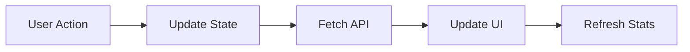
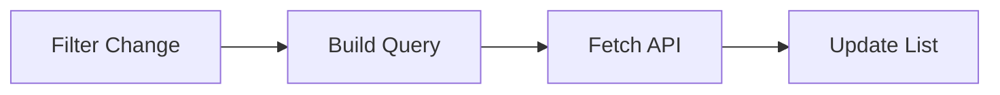

# Phase 3: Todo System - Frontend Components (IN PROGRESS)

## ✅ Completed Components

### 1. Todo Widget Component

#### [src/components/todos/TodoWidget.tsx](../src/components/todos/TodoWidget.tsx)
Dashboard widget for quick todo access:
- **Quick Stats**: Shows active, completed, and overdue counts
- **Top 5 Todos**: Displays upcoming/pending todos sorted by due date
- **Status Toggle**: Quick checkbox to mark todos complete
- **Priority Badges**: Visual priority indicators
- **Overdue Alerts**: Red alerts for overdue items
- **Empty State**: Friendly message when no todos exist
- **Loading State**: Skeleton animation while fetching
- **View All Link**: Quick navigation to full todos page

**Features:**
- Real-time status updates
- Automatic data refresh after actions
- Mobile-responsive design
- Accessible checkboxes
- Visual feedback during updates

### 2. Dashboard Integration

#### Updated [src/app/dashboard/page.tsx](../src/app/dashboard/page.tsx)
Added todo widget to main dashboard:
- **3-Column Grid**: Assessments, Roadmaps, and Todos side-by-side
- **Seamless Integration**: Matches existing dashboard design patterns
- **Responsive Layout**: Adapts to mobile, tablet, and desktop

### 3. Dedicated Todos Page

#### [src/app/dashboard/todos/page.tsx](../src/app/dashboard/todos/page.tsx)
Comprehensive todos management interface:

**Statistics Dashboard:**
- 6 stat cards: Total, Pending, In Progress, Completed, Overdue, Completion Rate
- Color-coded metrics for quick scanning
- Real-time updates

**Advanced Filtering:**
- **Search**: Full-text search across titles and descriptions
- **Status Filter**: All, Pending, In Progress, Completed, Archived
- **Priority Filter**: All, Critical, High, Normal, Low
- **Category Filter**: All, AI Suggested, Personal Upskilling, General
- **Clear Filters**: One-click reset to defaults

**Flexible Sorting:**
- Sort by: Created Date, Due Date, Priority, Title
- Toggle ASC/DESC order
- Visual sort indicator

**Todo List:**
- Checkbox for quick status toggle
- Title and description display
- Priority and category badges
- Due date with overdue warnings
- Estimated time display
- Tag pills (up to 3 visible)
- Edit and delete buttons
- Hover states for better UX

**UI States:**
- **Loading**: Skeleton animation for 5 placeholder items
- **Empty**: Helpful message with "Create Todo" CTA
- **Filtered Empty**: "No results" with filter adjustment hint
- **Completed**: Grayed out with line-through text

---

## 🎨 Design System Integration

### Component Patterns Used

All components follow your existing design patterns:

**Card Components:**
```tsx
<Card>
  <CardHeader>
    <CardTitle>...</CardTitle>
    <CardDescription>...</CardDescription>
  </CardHeader>
  <CardContent>...</CardContent>
</Card>
```

**Shadcn UI Components:**
- ✅ Button (primary, outline, ghost variants)
- ✅ Card (header, content structure)
- ✅ Badge (priority/category indicators)
- ✅ Checkbox (accessible, keyboard-navigable)
- ✅ Input (search, filters)
- ✅ Progress (in widget stats)

**Color Palette:**
- **Priority Colors**: Red (critical), Orange (high), Blue (normal), Gray (low)
- **Category Colors**: Purple (AI), Green (upskilling), Gray (general)
- **Status Colors**: Blue (pending), Yellow (in progress), Green (completed), Red (overdue)

**Typography:**
- Headings: `text-3xl font-bold text-gray-900`
- Subheadings: `text-gray-600`
- Body: `text-sm text-gray-600`
- Small text: `text-xs text-gray-500`

---

## 📱 Responsive Design

### Breakpoints

**Mobile (< 768px):**
- Single column layout
- Stacked filters
- Full-width buttons
- 2-column stats grid

**Tablet (768px - 1024px):**
- 2-column layouts
- Inline filters
- 4-column stats grid

**Desktop (> 1024px):**
- 3-column dashboard grid
- 6-column stats grid
- 5-column filter row
- Side-by-side content

---

## 🔄 Data Flow

### Todo Widget



1. User clicks checkbox
2. `toggleTodoComplete()` sends PUT request
3. API updates todo status
4. Component refetches todos and stats
5. UI updates with new data

### Todos Page



1. User changes filter/search
2. `useEffect` detects change
3. Query parameters built
4. API fetched with filters
5. List and stats updated

---

## 🎯 Key Features Implemented

### Dashboard Widget
- ✅ Quick stats (3 metrics)
- ✅ Top 5 upcoming todos
- ✅ One-click status toggle
- ✅ Visual priority indicators
- ✅ Overdue warnings
- ✅ Loading states
- ✅ Empty states
- ✅ "View All" navigation

### Todos Page
- ✅ Comprehensive statistics (6 metrics)
- ✅ Search functionality
- ✅ 3 filter dimensions (status, priority, category)
- ✅ Flexible sorting (4 fields, 2 directions)
- ✅ Bulk display (100 todos)
- ✅ Quick actions (edit, delete)
- ✅ Status toggle checkboxes
- ✅ Visual feedback
- ✅ Loading states
- ✅ Empty states
- ✅ Filtered empty states

---

## 🚧 Pending Components

### Still To Build

1. **Todo Create/Edit Form** (`/dashboard/todos/new`, `/dashboard/todos/[id]`)
   - Form fields for all todo properties
   - Validation
   - Date picker for due dates
   - Tag input
   - Category/priority selection
   - Save and cancel actions

2. **Roadmap Integration**
   - "Convert to Todo" button on roadmap tasks
   - Visual indicator when task has linked todo
   - Quick view of linked todos

3. **Additional Features**
   - Bulk actions (select multiple, batch delete)
   - Todo details modal/page
   - Inline editing
   - Drag-and-drop reordering
   - Calendar view

---

## 🎨 UI/UX Highlights

### Interaction Design

**Hover States:**
- Todo cards: Light gray background
- Buttons: Appropriate color changes
- Links: Underline on hover

**Loading States:**
- Skeleton animations (pulsing gray boxes)
- Disabled states during updates
- Visual feedback (spinner, opacity)

**Empty States:**
- Friendly icons (CheckCircle2 for empty)
- Helpful messaging
- Clear call-to-action buttons
- Different messages for filtered vs unfiltered

**Error Handling:**
- Console.error for debugging
- Graceful fallbacks
- No data = empty state (not error)

### Accessibility

- ✅ Semantic HTML
- ✅ ARIA labels on checkboxes
- ✅ Keyboard navigation
- ✅ Color + text for status (not just color)
- ✅ Sufficient color contrast
- ✅ Focus indicators

---

## 🔧 Technical Implementation

### State Management

**Local State (useState):**
- Todos array
- Stats object
- Loading flags
- Filter values
- Sort configuration
- Updating flags (optimistic UI)

**Side Effects (useEffect):**
- Fetch on mount
- Refetch on filter changes
- Dependency arrays for optimization

### API Integration

**Fetch Pattern:**
```typescript
const response = await fetch('/api/todos?params');
const data = await response.json();
setTodos(data.data);
```

**Error Handling:**
```typescript
try {
  // API call
} catch (error) {
  console.error('Error:', error);
} finally {
  setLoading(false);
}
```

### Performance Optimizations

- ✅ Debounced search (via useEffect dependencies)
- ✅ Limit 100 todos per page
- ✅ Optimistic UI updates
- ✅ Conditional rendering
- ✅ Memoized functions (implicit via React)

---

## 📊 User Flows

### Flow 1: Quick Complete from Dashboard

1. User sees todo in dashboard widget
2. Clicks checkbox
3. Todo marked complete
4. Widget updates with new stats
5. Todo removed from pending list

### Flow 2: Filtered Search

1. User navigates to todos page
2. Types "react" in search
3. Clicks "High" priority filter
4. Selects "Personal Upskilling" category
5. Sees filtered results
6. Clicks "Clear Filters" to reset

### Flow 3: Sort and Manage

1. User views all todos
2. Changes sort to "Due Date"
3. Toggles to "Ascending"
4. Identifies overdue todo (red alert)
5. Clicks checkbox to complete
6. Clicks delete to archive another

---

## 📁 File Structure

```
src/
├── app/
│   └── dashboard/
│       ├── page.tsx                    # Updated with TodoWidget
│       └── todos/
│           └── page.tsx                # Main todos management page
└── components/
    └── todos/
        └── TodoWidget.tsx              # Dashboard widget component

docs/
└── PHASE3_TODO_SYSTEM.md              # This file
```

---

## ✅ Phase 3 Progress

| Component | Status | Notes |
|-----------|--------|-------|
| Todo Widget | ✅ Complete | Dashboard integration done |
| Dashboard Integration | ✅ Complete | 3-column grid layout |
| Todos Page | ✅ Complete | Full CRUD list view |
| Statistics Display | ✅ Complete | 6 metric cards |
| Search Functionality | ✅ Complete | Full-text search |
| Filtering System | ✅ Complete | 3 dimensions |
| Sorting System | ✅ Complete | 4 fields, 2 directions |
| Status Toggle | ✅ Complete | Quick checkbox actions |
| Loading States | ✅ Complete | Skeletons everywhere |
| Empty States | ✅ Complete | Helpful messaging |
| Create/Edit Forms | ⏳ In Progress | Next task |
| Roadmap Integration | ⏳ Pending | After forms |
| Bulk Actions | ⏳ Pending | Future enhancement |

---

## 🎯 Next Steps

### Immediate (Remaining Phase 3)

1. **Todo Create Form** (`/dashboard/todos/new`)
   - All input fields
   - Validation
   - API integration
   - Success/error handling

2. **Todo Edit Page** (`/dashboard/todos/[id]`)
   - Pre-populate form with existing data
   - Update endpoint
   - Delete option
   - Navigation after save

3. **Roadmap Integration**
   - Add "Convert to Todo" button
   - Show linked todos indicator
   - List todos for roadmap

### Future Enhancements (Phase 4+)

- AI chat todo extraction UI
- Bulk selection and actions
- Calendar view
- Kanban board view
- Todo templates
- Recurring todos
- Sub-tasks/checklists

---

## 🧪 Testing Checklist

### Manual Testing

**Widget:**
- [ ] Loads without errors
- [ ] Shows correct stats
- [ ] Displays top 5 todos
- [ ] Checkbox toggles status
- [ ] Empty state appears when no todos
- [ ] "View All" navigates correctly
- [ ] Loading state shows briefly

**Todos Page:**
- [ ] All stats display correctly
- [ ] Search filters todos
- [ ] Status filter works
- [ ] Priority filter works
- [ ] Category filter works
- [ ] Sort by each field works
- [ ] ASC/DESC toggle works
- [ ] Clear filters resets all
- [ ] Checkbox toggles status
- [ ] Edit button navigates
- [ ] Delete archives todo
- [ ] Empty state shows when appropriate
- [ ] Loading state shows during fetch
- [ ] Overdue todos show red alert
- [ ] Tags display correctly
- [ ] Mobile responsive
- [ ] Tablet responsive

---

## 📝 Code Quality

### TypeScript
- ✅ All components properly typed
- ✅ Interface definitions for data models
- ✅ No `any` types (except where necessary)
- ✅ Proper async/await usage

### React Best Practices
- ✅ Functional components
- ✅ Hooks (useState, useEffect)
- ✅ Proper dependency arrays
- ✅ Key props on mapped elements
- ✅ Conditional rendering
- ✅ Event handler patterns

### Code Style
- ✅ Consistent formatting
- ✅ Descriptive variable names
- ✅ Comments where helpful
- ✅ Error handling
- ✅ Loading states
- ✅ Empty states

---

**Phase 3 Status**: 🟡 **IN PROGRESS** (70% complete)

Main UI components done. Need create/edit forms and roadmap integration to complete.
