# NextFullStep - User Flow Diagram

## Main User Flow (Mermaid Diagram)

## Onboarding Flow Details

## Assessment Flow Details

```mermaid
flowchart TD
    Start([Select Career Role]) --> CreateAssessment[Create/Resume Assessment]

    CreateAssessment --> Q1[Question 1:<br/>Background & Skills]
    Q1 -->|Save| Q2[Question 2:<br/>Experience]
    Q2 -->|Save| Q3[Question 3:<br/>Learning Ability]
    Q3 -->|Save| Q4[Question 4:<br/>Time Availability]
    Q4 -->|Save| Q5[Question 5:<br/>Resources]
    Q5 -->|Save| Q6[Question 6:<br/>Commitment]
    Q6 -->|Save| Q7[Question 7:<br/>Obstacles]
    Q7 -->|Save| Q8[Question 8:<br/>Goals]

    Q8 -->|Complete| Trigger[Trigger AI Analysis]

    Trigger --> AI[AI Processing:<br/>- Analyze responses<br/>- Calculate score<br/>- Determine tier<br/>- Generate roadmap]

    AI --> Verdict{Verdict Tier}

    Verdict -->|Score 80-100%| Qualified[✅ QUALIFIED NOW<br/>Ready to start]
    Verdict -->|Score 60-79%| Nearly[⚡ NEARLY QUALIFIED<br/>Few gaps to fill]
    Verdict -->|Score 40-59%| Gaps[📚 SIGNIFICANT GAPS<br/>Learning needed]
    Verdict -->|Score 0-39%| NotViable[🔄 NOT VIABLE<br/>Major pivot needed]

    Qualified --> Results[Show Results Page]
    Nearly --> Results
    Gaps --> Results
    NotViable --> Results

    Results --> GenerateRoadmap[Auto-Generate<br/>Personalized Roadmap]

    GenerateRoadmap --> Done([View Roadmap])

    style AI fill:#ffe0b2
    style Qualified fill:#c8e6c9
    style Nearly fill:#fff9c4
    style Gaps fill:#ffccbc
    style NotViable fill:#ffcdd2
```

## Roadmap Structure

## Authentication & Authorization Flow

---

## Key User Journeys

### Journey 1: New User → First Roadmap

### Journey 2: Returning User → Continue Progress

### Journey 3: Multi-Role Exploration

---

## Route Structure

### Public Routes (No Auth Required)
- `/` - Landing (redirects to /careers)
- `/careers` - Career roles listing
- `/pricing` - Subscription plans
- `/sign-in` - Authentication
- `/sign-up` - Registration

### Protected Routes (Auth Required)
- `/dashboard` - User dashboard
- `/dashboard/settings` - Account settings
- `/dashboard/todos` - Todo management
- `/dashboard/todos/new` - Create todo
- `/dashboard/todos/{id}` - Todo details
- `/onboarding` - First-time setup
- `/assessment/start/{roleId}` - Take assessment
- `/assessment/{id}/results` - View results
- `/roadmap/{id}` - View roadmap

---

## API Endpoints

### Career & Assessment APIs

### Roadmap & Progress APIs

---

## Database Schema Overview

---

## Progress Tracking System

---

## Subscription Tier Limits

---

## Summary

This comprehensive Mermaid diagram set visualizes:

1. **Main User Flow** - Complete journey from landing to roadmap tracking
2. **Onboarding Flow** - 3-step setup process
3. **Assessment Flow** - Question answering and AI analysis
4. **Roadmap Structure** - Phase-based task organization
5. **Authentication Flow** - Security and access control
6. **User Journeys** - Different user scenarios
7. **API Sequences** - Backend communication patterns
8. **Database Schema** - Data relationships
9. **Progress Tracking** - Streak and completion calculations
10. **Subscription Limits** - Tier-based access control

Each diagram can be rendered in any Mermaid-compatible viewer (GitHub, GitLab, VS Code with Mermaid extension, etc.).
