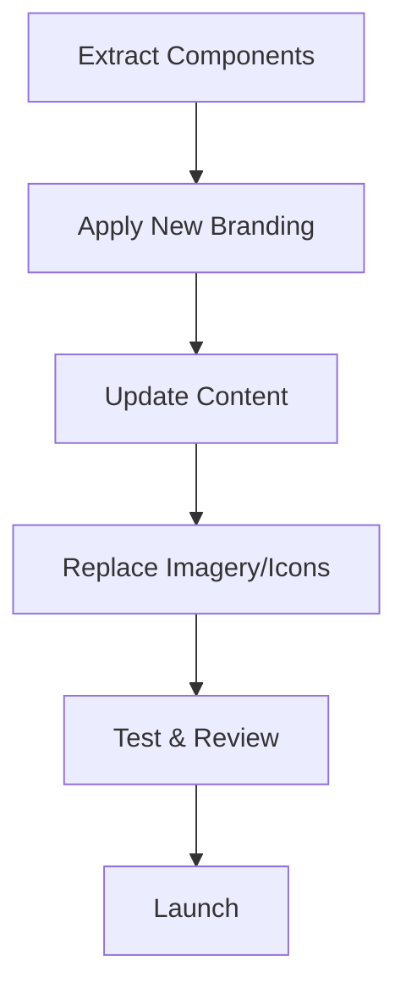

# Landing Page Adaptation Plan

This plan outlines how to leverage the previous landing page structure for your new project, keeping all major sections but updating content and branding.

---

## 1. Section Structure (to be preserved)

- Hero Section
- Assessment Flow
- Benefits (Problem/Solution)
- Features
- How It Works
- Testimonials
- Final Call to Action (CTA)
- Footer

---

## 2. Adaptation Steps

### A. Content Update

- Rewrite all headlines, subheadlines, and body copy to reflect your new project’s mission, value proposition, and target audience.
- Update testimonials with quotes and names relevant to your new project, or use placeholders until new testimonials are available.
- Revise assessment names, benefits, and features to match your new offering.

### B. Branding & Visuals

- Replace color palette, fonts, and logo to match your new branding (see `ProjectDocs/brandingDescription.md` for reference).
- Swap out all imagery (hero, features, avatars) for visuals that align with your new brand and audience.
- Update icons if your new project’s theme or industry requires different visual cues.

### C. Technical & UX Enhancements

- Ensure all sections are accessible (color contrast, alt text, keyboard navigation).
- Optimize images for performance and SEO.
- Review responsiveness on all device sizes.
- Add or update meta tags and Open Graph data for SEO.

### D. Workflow

1. Review and extract reusable components from the previous landing page.
2. Apply new branding (colors, logo, fonts) globally.
3. Update content section by section, referencing your new project’s goals and branding guidelines.
4. Replace imagery and icons as needed.
5. Test the landing page for accessibility, responsiveness, and performance.
6. Gather feedback and iterate.

---

## 3. Adaptation Workflow Diagram

---

**Reference:**  
- Branding guidelines: `ProjectDocs/brandingDescription.md`
- Previous landing page: `G:/Development Projects/ExcellentEvolution/frontend/app/page.tsx`